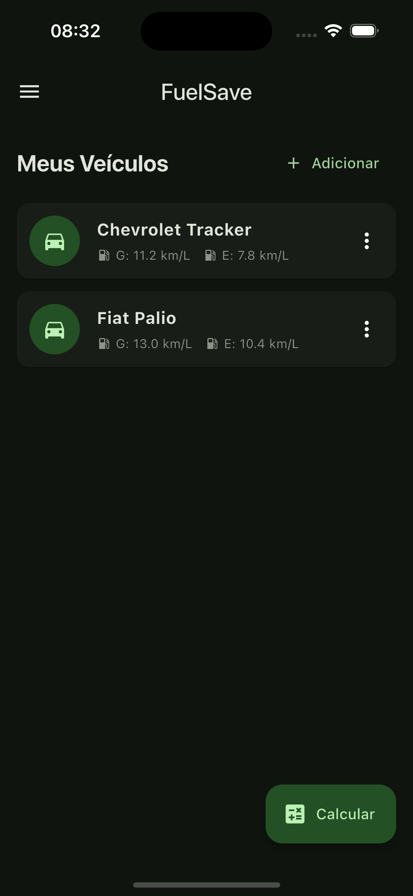
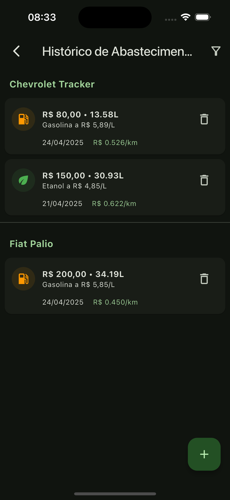
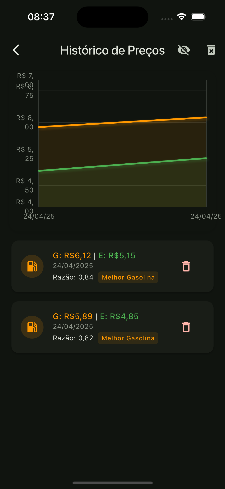

<table>
  <tr>
    <td></td>
    <td>
      <h1>FuelSave App ⛽️🚗💨</h1>
      <strong>Economia e controle na palma da sua mão!</strong>
    </td>
  </tr>
</table>


**FuelSave** é um aplicativo desenvolvido em Flutter com o objetivo de ajudar motoristas brasileiros a **economizar combustível** e **gerenciar o histórico de abastecimentos** de forma prática e inteligente. Compare os custos entre gasolina e etanol com base no consumo real do seu veículo e tome decisões mais vantajosas!

---

## ✨ Funcionalidades

- 🚘 **Cadastro de Veículos:**  
  Cadastre seus carros com o consumo médio de gasolina e etanol.

- 🧠 **Calculadora Flex Inteligente:**  
  Informe os preços atuais dos combustíveis e descubra qual opção oferece o melhor custo-benefício, baseado no consumo do veículo.

- 📝 **Histórico de Abastecimentos:**  
  Registre seus abastecimentos com data, tipo de combustível, valor total, preço por litro, e visualize o custo por quilômetro. Filtre por veículo, edite ou exclua registros facilmente.

- 📊 **Histórico de Preços:**  
  Armazene os preços utilizados na calculadora para acompanhar a variação dos valores ao longo do tempo.  
  *(Melhoria futura: filtros por período)*

- 🌙 **Interface Moderna e Intuitiva:**  
  Layout limpo e responsivo com suporte ao **tema escuro**, pensado para facilitar o uso no dia a dia.

- 📱 **Dados Locais e Privados:**  
  Todos os dados ficam armazenados **apenas no seu dispositivo** utilizando `sqflite`, garantindo privacidade e funcionamento offline.

- 🔀 **Multiplataforma:**  
  Desenvolvido com Flutter para rodar em Android e iOS.

---

## 📸 Telas

<table>
  <tr>
    <th>Tela Inicial</th>
    <th>Calculadora Flex</th>
    <th>Histórico de Abastecimentos</th>
    <th>Histórico de Preços</th>
  </tr>
  <tr>
    <td></td>
    <td></td>
    <td></td>
    <td></td>
  </tr>
</table>

---

## 🚀 Tecnologias Utilizadas

- **Flutter** – Framework multiplataforma
- **Dart** – Linguagem principal do projeto
- **Provider** – Gerenciamento de estado
- **sqflite** – Banco de dados local
- **path_provider** & **path** – Manipulação de caminhos
- **intl** – Formatação de datas e moedas
- **fl_chart** – Visualização de dados

---

## 🛠️ Como Executar o Projeto

1. **Pré-requisitos**
   - [Flutter SDK](https://flutter.dev/docs/get-started/install) instalado
   - Editor como [VS Code](https://code.visualstudio.com/) ou [Android Studio](https://developer.android.com/studio)
   - Emulador/simulador ou dispositivo físico Android/iOS

2. **Clone o repositório**
   ```bash
   git clone https://github.com/luisfelipe03/fuelsave.git
   cd fuelsave
   ```

3. **Instale as dependências**
   ```bash
   flutter pub get
   ```

4. **Execute o app**
   ```bash
   flutter run
   ```

---

## 📁 Estrutura do Projeto

```bash
lib/
├── core/               # Lógica central (modelos, providers, banco, enums)
│   ├── database/
│   ├── enum/
│   ├── models/
│   └── providers/
├── modules/            # Telas e funcionalidades principais
│   ├── calculator/
│   ├── car_management/
│   ├── history/
│   ├── home/
│   └── splash/
├── shared/             # Widgets reutilizáveis
│   └── widgets/
└── main.dart           # Ponto de entrada da aplicação
```

---

## 📌 Contribuindo

Contribuições são bem-vindas! Sinta-se à vontade para abrir **issues** ou enviar **pull requests** com melhorias, correções ou sugestões.
